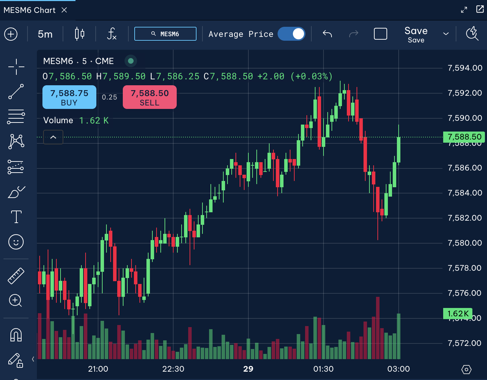
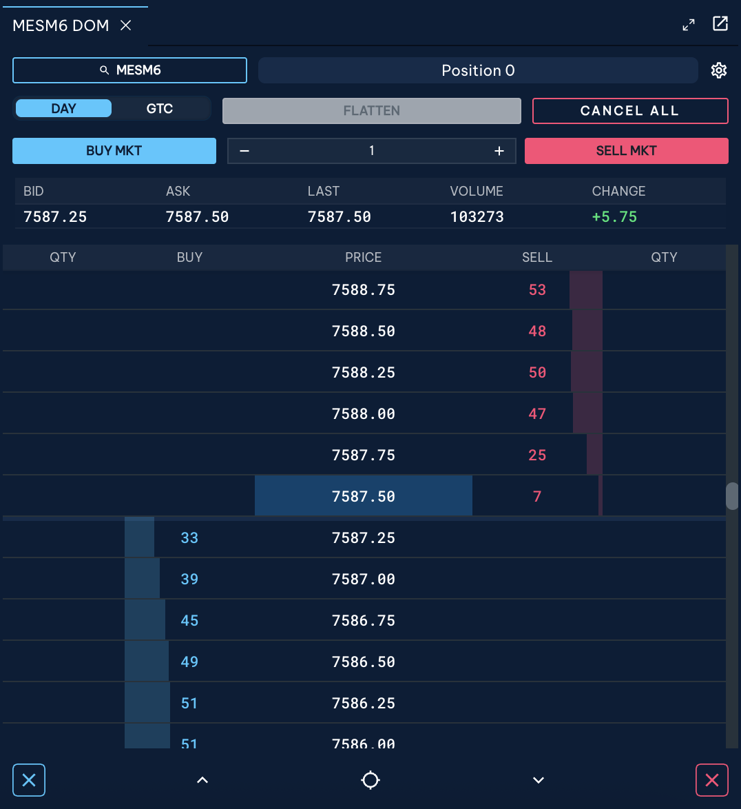
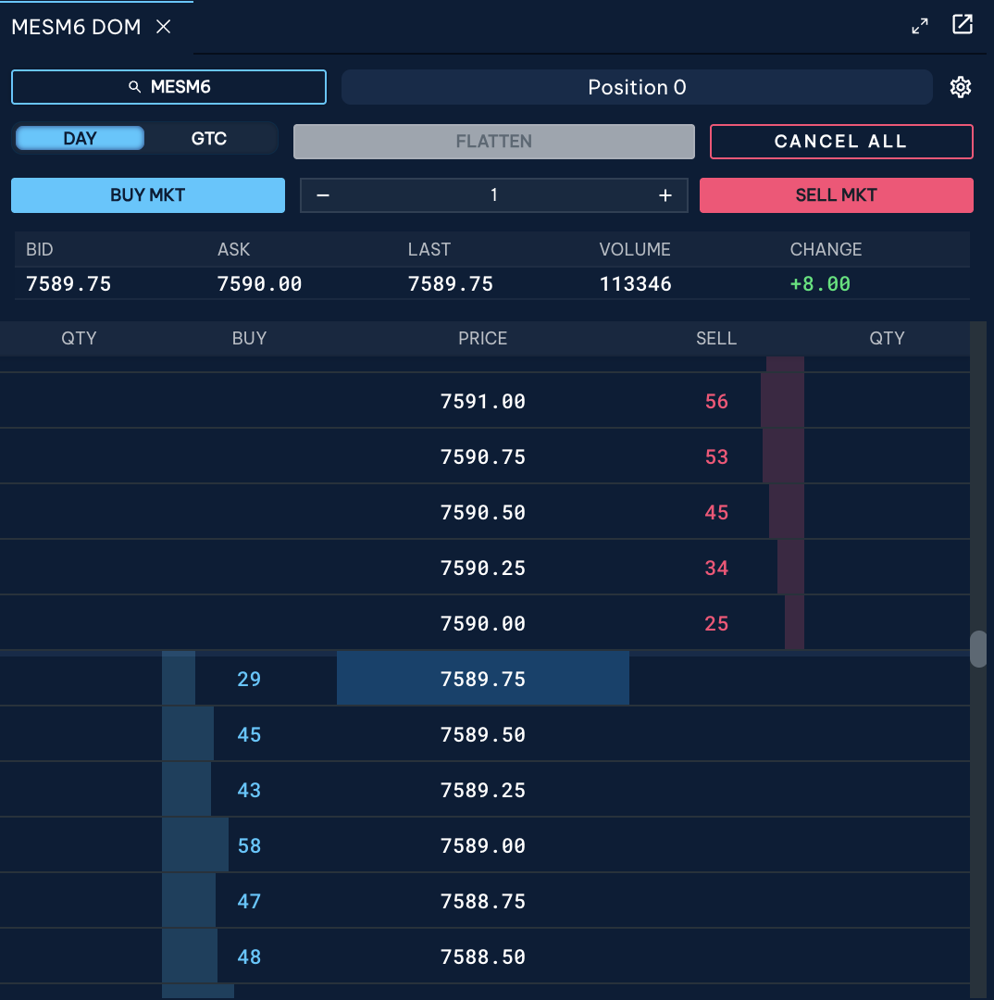
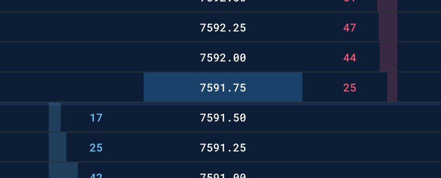
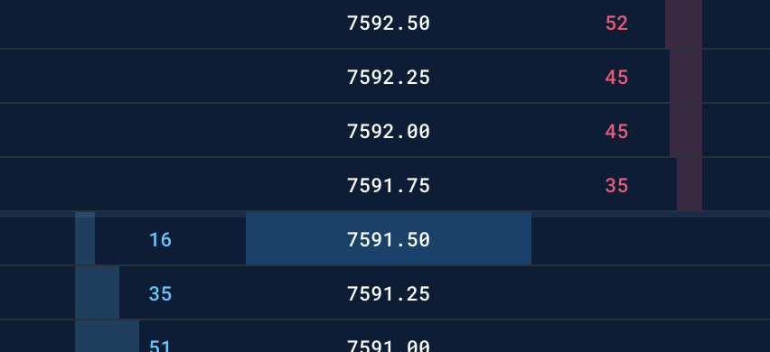
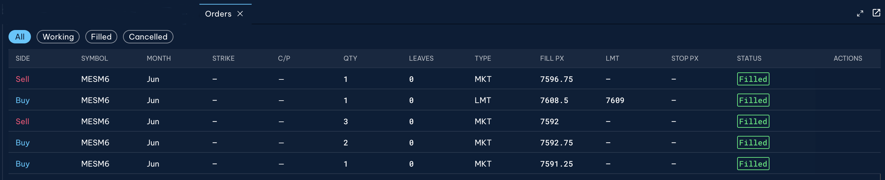

# CME合约及Simulatior

## 合约的基本信息

介绍CME的期货合约结构，我们使用的合约是**Micro E-mini S&P 500 Index**合约，合约的符号是`MESXX`合约。

该contract unit: `$5` X `S&P 500 Index`，合约单位是**5倍**的**标准普尔500指数**。

**Minimum Price Fluctuation 最小价格波动**：
- Outright: 0.25 index points = $1.25
    - 单腿合约，就是普通买卖期货，这种只有一个合约月份参与的交易。index的最小跳动是0.25点，那么MES的价格变化单位就是 0.25X5=1.25美元
    - 在7591.50时候，购买1手的MES开仓多头；如果价格变成7591.75，那么你就赚了1.25. 
- CALENDAR SPREAD 0.05 index points = $0.25
    - 日历价差，不是买卖指数方向，而是不同月份之间的价差

**名义价值，Nominal Value**
对于MES合约，1手的**名义价值 Nominal Value** 就是：**$5 X S&G 500 Index**
- 比如当前S&P500=7591，那么一手MES合约的 Nominal Value = 7591X$5= $ 37,955.00

而另一个合约**ES**，`E-mini S&P 500` Futures，这个合约就大了，一手ES合约 = **$50 X S&G 500 Index**
- 比如当前S&P 500=7591，那么**1手ES**的**名义价值 nominal value** 就是：7591X50 = $379,550.00

所以从这个角度来看**MES**合约的规模只是**ES**合约规模的10%，这也是推出micro合约的意义之一。

当然 名义价值 Nominal Value就是名义价值，是你缴纳的持仓保证金只是一小部分。

## 合约名字的月份标准代码

因为一开始合约是在大厅进行交易的，所以，月份代码不会使用 January 这样这么长的名字。
标准月份代码：

|月份|代码|
|---|---|
|1月 January|F|
|2月 February|G|
|3月 March|H|
|4月 April|J|
|5月 May|K|
|6月 June|M|
|7月 July|N|
|8月 August|Q|
|9月 September|U|
|10月 October|V|
|11月 November|X|
|12月 December|Z|

- 月份排序并不是连续的英文字母
    - **F-G-H**，一季度
    - **J-K-M**，二季度
    - **N-Q-U**，三季度
    - **V-X-Z**，四季度
- CLN6：CL-crude oil，N表示July，6表示2026。
    - CLN6合约，就是2026年7月的WTI原油期货。
- MESU6 或 MESU2026：就是2026年9月到期的MES合约。
- 对于股指期货，最主要的交割月份就是3、6、9、12这四个月的，对应 **H**、**M**、**U**、**Z**。
    - MESxx 合约就是股指期货合约，最主要的交割月份，就是H、M、U、Z 这4个月。

---

## 绿涨红跌，国际惯例
**Green UP, Red DOWN**
绿涨红跌，这是国际市场通行的准则，你要尽早习惯。

下面这个就叫：**Market Chart**，给你的是市场现在的K线状态。

- 合约名字是 **MESM6**，表示2026年M6月的MES合约。
- **4个价格**：
    - 上面四个字母，表示不同的价格
    - **O**（Open开盘价）、**H**（Hight 最高价）
    - **L**（Lowest最低价）、**C**（Current/Close当前价）。
- 现在价格7588.50，开盘价open是7586.50。这张K线图是“绿涨红跌”的。

---

## **Price Ladder**
Price ladder就是“价格阶梯”，这几个词差不多的意思：
- **Price Ladder** ：价格阶梯
- **DOM (Depth of Market)** ：市场深度
- **DOM Ladder**
- **Trading Ladder**

我们来看这张ladder


先看下半部分：
```text
          卖盘（Ask）
    7588.75    53
    7588.50    48
    7588.25    50
    7588.00    47
    7587.75    25
====================
7587.50 ← Last Price
====================
    7587.25    33
    7587.00    39
    7586.75    45
    7586.50    49
    7586.25    51
买盘（Bid）
```
这个就是`卖盘Ask`和`买盘Bid`的列表。
ASK中，7588.75@53，就是53手卖单挂在7588.75，等着别人来买。

**那么，当前市场在哪里？**

看顶部的显示：
- **BID**       7587.25
- **ASK**       7587.50
- **LAST**      7587.50
- **VOLUME**    103273 
- **CHANGE**    +5.75   （但是这个，不是对open价，TBC）


## **GTC**和**DAY**
这两个条件，就是下单的有效性
> - **DAY** order：当天有效
> - **GTC** order：Good Till Cancelled 取消前都有效
>   - 一般是30天、60天、90天之后失效

**Price Ladder**显示的是“**未成交订单**”，把它们放在pool里展示。

---

# 究竟是怎么样成交的呢？

Price Ladder也可以叫做 **Order Book**，这是一个期货交易中，非常重要的词。。
很多人会有一个困惑：**Order Book**里面的订单，到底什么时候显示？什么时候成交？什么时候消失？


现在盘口：
```text
              卖盘（ASK）
       7590.00     25手
----------------------
 29手  7589.75     
 45手  7589.50     
 43手  7589.25     
 58手  7589.00     
买盘（Bid）
-
上一成交价是 7589.75
```

现在这个买盘，这么一瞬间，没有成交的，Buy和Sell的信息都已经挂在这 DOM/Price Ladder上了。引入2 **new concepts**:
- **Best Bid**：最容易成交的买价，那就是**最高买价**
- **Best Ask**：最容易成交的卖价，那就是**最低的卖价**

在我们这个例子中：
- **Best Bid**：7589.75
- **Best Ask**：7590.00

现在的order book的现状就是这样子。你可以理解在这么一瞬间，就是卡住了。那么交易还要继续，要么是做市商注入流动性，要么是真的有需求单进来。我们现在模拟不同的情况。

--

## 来一个 Buy Limit 7589.00

如果这个时候我进来提交：
- **Buy 1 @ 7589.00**

那么这个时候，因为Ask的最低是7590.00，自然成交不了，系统就会把我的单放进 Order Book，那么 Orderbook 就会发生一点变化：

Bid这边会多一条记录：**7589.00  59手**
盘口会变成：
```text
              卖盘（ASK）
       7590.00     25手
----------------------
 29手  7589.75     
 45手  7589.50     
 43手  7589.25     
 59手  7589.00     +1
买盘（Bid）
-
上一成交价是 7589.75
```
之前58手，现在59手嘛。

--

## 来一个 Buy Limit 7590.00
如果这个时候我进来提交：
- **Buy 1 @ 7590.00**

这个时候的一瞬间，**Bid的最高** >= **Ask的最低**，就是 “**Best Bid >= Best Ask**”。因此不会停留在Order Book上，而是会**立刻成交**。这个过程就是：
我买1手
   ↓
吃掉Ask上的1手
   ↓
成交价7590.00

成交之后，ASK就会变成：**7590.00 @ 24手**，Order Book也会立刻变成：
```text
              卖盘（ASK）
       7590.00     24手
----------------------
 29手  7589.75     
 45手  7589.50     
 43手  7589.25     
 58手  7589.00     
买盘（Bid）
-
上一成交价是 7590.00  <--刚成交的成交价
```

只不过你可能都看不到这个订单的出现，他就被成交了，整个过程可能只有几微秒。

--

## 来了一个 Sell Limit 7588.75
如果这个时候我进来提交：
- **Sell 1 @ 7588.75。**

那么在那非常的一瞬间，就会出现：
- **Best Ask = 7588.75**
- **Best Bid = 7589.75**

对于限价单 limit order，只要满足：
- **Buy Limit >= Best Ask**
- **Sell Limit <= Best Bid**
都会促成交易的达成，由系统优先成交。

现在的情况就是：Sell limited <=Best bid，即 7588.75<=7589.75。能够进行成交！成交的价格并不是 7588.75，而是以7589.75成交。成交之后的盘口就会变成：

```text
              卖盘（ASK）
       7590.00     25手
----------------------
 28手  7589.75     -1
 45手  7589.50     
 43手  7589.25     
 58手  7589.00
 --
 x手   7588.75   <--一sell limit 1手在这里，但成交不在这里     
买盘（Bid）
-
上一成交价是 7589.75    <--依然按照7589.75成交。
```


## ladder是啥呢
Price Ladder看到的是“未成交订单”，而并非“所有提交过的订单”。
Price Ladder，also called “Order Book”，是“所有尚未成交的买卖意愿池”。
对于系统来说，收到订单之后，能成交的会立刻撮合成交，也就来不及显示了。
这就好比一个市场上交易苹果，买苹果的人出的最高价10元，然后卖苹果的人出的最低价是11元。这个时候肯不会形成订单。然后如果你说，我要10.5元买进，或者10.5元卖出，那么你的这个报单也不会成交，就会被挂在墙上：这就相当于在Order Book上显示出来了。如果你现在说我的报价是11元买进，那么你就会被立刻成交，你的报单就不会被挂在墙上了！！！

整个交易过程的简化视角：
```text
新订单
↓
吃掉旧订单
↓
最佳Bid变化
↓
最佳Ask变化
↓
Last Price变化
↓
K线形成
```

---

# BID-ASK 和 BUY-SELL区别

很多人确实有点懵逼，这也容易混淆。Bid-Ask和 Buy-Sell，它们不是一个维度的东西。

第一层：BUY / SELL 是“你的动作”，描述的是，你要干什么？
- **BUY MKT**：我现在要买
- **SELL MKT**：我现在要卖

所以，BUY和SELL描述的是**交易行为**。

第二层：BID / ASK 是“Order Book状态”，这是在 DOM 里面显示的，描述的是“市场里目前有哪些挂单？”
- BID 7591.50: 有人挂着买
- ASK 7591.75：有人挂着卖

所以，BID和ASK描述的是**订单簿状态、(Order Book State)**。

如果此时订单簿是：
```text
        ASK
7591.75 @ 1手
-------------
7591.50 @ 1手
Bid
```
你这个时候：
- **Best Ask** = 7591.75
- **Best Bid** = 7591.50

你现在来了，点击 **`BUY MKT`**，主动买进（就是买入开仓多头）：
- 你就会吃掉卖的Ask，你肯定是顺着Ask的意思来，按照**Best Ask**成交于 7591.75
- **`BUY MKT`** ---> **Hit the Ask**
    - BUY MKT，要找的是，中间横线另一侧的 Best Ask

同样，你现在来了，点击 **`SELL MKT`**，主动卖出：
- 你就会吃掉买的Bid，你肯定是顺着Bid的意思来，按照**Best Bid**成交于 7591.50
- **`SELL MKT`** ---> **Hit the Bid**
    - SELL MKT，要找的就是，中间横线另一侧的 Best Bid

> 专业交易员经常说的话：
- 不会说：有人买了
    - 而是：**Buyer lifted the Ask**
    - 就是：买家把卖盘吃掉了。
同样，
- 不会说：有人卖了
    - 而是：**Seller hit the bid**
    - 就是：卖家把买盘打掉了

> 总结起来就是：

|你的动作| 吃掉谁 |成交价|
|---|---|---|
|**BUY MKT**|ASK|**Best Ask** Price|
|**SELL MKT**|BID|**Best Bid** Price|


那么在order flow领域：
- 成交在 Ask = 主动买
- 成交在 Bid = 主动卖

> 精炼概括：
- BUY / SELL 是交易者的动作
- BID / ASK  是订单簿里的报价
- **BUY MKT** 会吃掉 **ASK** / **SELL MKT** 会打掉 **BID**

---

阅读完上面的内容，就会有下面的细分。

## 成交在Ask vs. 成交在Bid

一笔成交，永远有卖家和买家，两方的数量相等，成交价格只有一个。但是这里，还有个关键的区别：

> 谁是主动方（Aggressor）？

你仔细看看下面两张图：


你看到没有，这个oder book / DOM / price ladder上，成交的时候亮一下，但是有时候在中线上面，有时候在中线下面。这就有意思了，我们可以慢慢分析一下。

> 什么是 Best Ask

Best Ask，或 Ask 就是“最低卖价”，是当前市场上**最便宜的卖家报价**。also called “Best Offer”。
卖家A：
卖1手 @ 7590.00
那么，Best Ask = 7590.00

> 什么是 Best Bid

Best Bid，或 Bid 就是“最高买价”，是当前市场上最愿意出高价的买家报价。
买家B：
买1手 @ 7589.75
那么，Best Bid = 7589.75

如果一个order book是这样：
```test
              Ask
    7590.00   x手
-----------------
x手 7589.75
Bid
```

这样对当前市场的结论：
- **Ask** = 7590.00
- **Bid** = 7589.75
- 这就是现在Order Book的明细

> 什么是 **成交在Ask**

如果我点击`BUY MKT`，系统会说：OK，市场上现在最便宜的卖家报价是 7590.00元，那么成交价等于7590.00元。DONE！
这个时候的成交会被记作：

- **Trade at Ask**
- or **Ask Volume**
- 表示：这笔交易发生在“卖方报价（Ask）”上。
- 交易肯定是有卖家有买家。只不过这个时候，主动发起交易的是“买家”。
- 成交在Ask = 主动买

> 什么是 **成交在Bid**

我现在特别着急卖，点击`SELL MKT`。系统说：OK，现在市场上最高买价是7589.75元，那么成交价等于7589.75元？？。DONE！
这个时候的成交会被记作：
- **Trade at Bid**
- or **Bid Volume**
- 表示：这笔交易发生在“买方报价（Bid）”上
- 主动发起交易的是“卖家”
- 成交在Bid = 主动卖

> 1000手成交发生在 Ask 价格是什么意思？

假定，当前Ask=7590.00。卖盘 7590.00@卖1000手。
如果这个时候很多买家冲进来：不停`BUY MKT`，最终把这1000手都吃掉。那么统计软件会记录：
**Ask Volume** = 1000
意思就是：
有1000手成交是**买方**主动发起的。
而不是说：挂着1000手Ask；而是说：1000手已经成交了。

总结起来就是：

|成交价|谁主动action|Order Flow解释
|---|---|---|
|Ask价成交|买家主动贴上去|Aggressive Buyer|
|Bid价成交|卖家主动贴上去|Aggressive Seller|

所以以后你看DOM的时候，如果不停看到：
```text
Ask成交
Ask成交
Ask成交
Ask成交
```
专业的会员就说：**买家**在扫货（**lifting the offer**）。即：买家不停主动吃盘。

同样地，如果不停看到：
```text
Bid成交
Bid成交
Bid成交
Bid成交
```
专业的会员就说：**卖家**在砸盘（**lifting the bid**）。即：卖家不停主动打买盘。

---

## 为什么价格会上涨？

如果你从供求的关系来看，会发现，所有的成交，都是“卖方数量=买方数量”，否则交易就不可能完全达成。那么就会有个随之而来的问题：
> 如果买卖数量永远相等，那么为什么价格会上涨呢？

对啊！点解呢？

**关键：不是数量，而是“谁更着急”**

假定此时的 Order Book：
```text
          Ask
7590.50 @ 60手 
7590.25 @ 25手
7590.00 @ 25手
-------------
7589.75 @ 29手
Bid
上一笔成交价格：7590.00元
```
- 情况A：都淡定
买家不着急，卖家也不着急。两方都咬住自己的价格，死活不松口。
于是：没人成交，价格不动。
--
- 情况B：买家着急
来了个基金说，我要立刻1000手。
于是`BUY MKT`，开始扫单。先吃掉了7590.00@25手的卖单；然后7590.25，然后7590.50的so on，这样价格就上涨了。
真实的原因是：买家愿意不断提高价格，去寻找卖家！买家越来越愿意让步。
    - 7590.00@25手，（7590.00-7500.00，上一笔7590.00）成交价：7590.00
    - 7590.25@25手，（7590.25-7590.25，上一笔7590.00）成交价：7590.25
    - 7590.50@60手，（7590.50-7590.50，上一笔7590.25）成交价：7590.50
    - 价格就是这样被一步步打上去了。
- 交易员会说：
    - Aggressive Buyers Dominating
    - 主动买盘占优势
    - 供求关系依然在，只不过形式变了。
    - 主动卖单不断吃Ask = 需求非常强
    - 价格上涨，更准确的说，是**买方的主动性强于卖方**，OR**买方愿意不断提高成交价格**。

所以这就解决了一直以来的困扰。


---

# CME的内核，和中国市场不同

建仓了之后的平仓，是需要指定平掉哪个头寸吗？
期货交易大多数时候管理的是 Net Position（净头寸），平仓时通常不需要指定平掉哪一笔成交记录，直接反向交易即可减少或关闭头寸。

我们今天有了一个完全突破认知的knowledge：
- CME这样的交易所，还有大部分的交易所，看待问题的方式和方法不一样。CME没有这样的概念：
    - 多开 - 开仓买入 - Buy 
    - 多平 - 平仓卖出 - Sell
    - 空开 - 开仓卖出 - Sell
    - 空平 - 平仓买入 - Buy
- CME核心关注的是**净头寸**，**Net Position**，更多从risk角度来分析，所以净头寸才是最关键的。
- CME上面只有 **Buy**和**Sell**这两选择。

看下面这个图片：

从下向上就是这个交易日下单的记录，我给你简单归纳一下：
seq1: Buy @ 1手
seq2: Buy @ 2手
seq3: Sell @ 3手
seq4: Buy @ 1手

我们现在如果试图把buy-sell翻译成“多空语言”：
那么Seq1和Seq2做完之后，只可能有一种position: Long @ 3
然后seq3就有意思了，seq3的操作可能有2种情况：
- 多平 @ 3手
- 空开 @ 3手
这两种情况是真的都有可能的呢。

那么在seq3操作完成之后的可能：
|seq2后头寸|seq3操作|seq3完成的头寸|
|---|---|---|
|Long 3|多平 @ 3|ZERO position|
||空开 @ 3|Long @ 3；Short @ 3|

那么同样，Seq4也是可能有2种可能：
- 多开 @ 1手
- 空平 @ 1手

那么在seq4操作完成之后的可能：
|seq3后头寸|seq4操作|seq4完成的头寸|
|---|---|---|
|ZERO Position|多开 @ 1手|Long @ 1|
|ZERO Position|空平 @ 1手|N/A|
|Long @ 3; Short @ 3|多开 @ 1手|Long @ 4; Short @ 3|
|Long @ 3; Short @ 3|空平 @ 1手|Long @ 3; Short @ 2|

所以你看，当你走到第4步的时候，如果分要剖析“多空布局”的可能性，那么就有上面的3种可能了，这就是个很复杂的问题了。这里第二种可能性是因为头寸为0所以不具备空平的可行性。

> 结论
你不可能，从“Buy-Sell”语言，完全还原成“多开-空平--空开-多平”这样的语言的。
从“多开-空平--空开-多平”语言，可以变成“Buy-Sell”语言。

---

## 困扰我们的bp sp cp

因为在电子撮合出现之前，以及一些证券交易教材中，经常会说：bp sp cp。中国很多教材最早借鉴的是：
* 证券市场撮合机制
* 集合竞价理论
* 老式订单驱动市场（Order Driven Market）

而市场真正运行的是：
Order Book
↓
价格优先
↓
时间优先
↓
撮合

而不是：
bp-sp-cp
↓
算公式
↓
成交

> 我们来仔细分析和解决这个问题。究竟交易系统是如何一步一步把买和卖匹配起来的呢？

假定现在的order book是这样的：
```text
Ask 100.00 @ 20手
-----------------
Bid  99.00 @ 15手
```
此时如果挂出新单：
`BUY LMT 110.00 @ 15手`
`SELL LMT 90.00 @ 10手`

这个时候应该会怎么成交呢？答案是：
> 不会出现110和90成交的订单。
> BUY LMT 110.00的订单，会以100.00成交
> SELL LMT 90.00的订单，会议99.00成交。

这里就要介绍一个重要原则：**Price Improvement，价格改善**。
- 你愿意110块买，但是市场有人100块卖，那就100块成交
- 你愿意90块卖，但是市场上有人99买，那就99块成交

再举一个例子：
```text
        Ask
102.00  20手
101.00  20手
100.00  20手
------------
```
如果你下单 BUY 110.00 @ 50手，那么最后的成交明细就是：
先成交：100.00 @ 20手
再成交：101.00 @ 20手
最后：  102.00 @ 10手
永远不会以买方报的110.00成交。

你看CME的例子中，上一个成交价Cp压根就没有参与到价格的形成过程中来。系统只看 Best Bid、Best Ask、Price Prioriry、Time Priority。

大家肯定会有个疑问：
```text
       Ask
100.00 @ 20手
------------
99.00 @ 15手
Bid
```
我现在如果挂一个 `SELL LMT 90.00 @ 10手`的话，按照上文说法，按照99.00成交，看起来我这个挂SELL单的人是被公平对待了，因为我本来想我卖的最低价是90块，没想到99块成交了，那就非常好。
可是如果99成交的话，对于之前已经挂出来 `BUY 99.00 @ 15手`的人来说，岂不是不公平了？我本来想着我能买的最高的价格是99块，然后明明有个人可能90块就卖，居然不让我们用他的90.00块成交，害得我多花了9.00块啊~

因为：
> Order Book 不是拍卖行。它是一个价格优先（Price Priority）的市场。

现代电子交易市场的原则是：
> **保护已经在订单簿里的订单（Resting Orders）。**

哪个订单先来的？是`BUY 99.00 @ 15手`这个订单先来的。然后 `SELL LMT 90.00 @ 10手` 后进来的。
因此，那个99块钱的订单是 **Resting Order**，**静态订单**。
而，那个90块钱的SELL订单是 **Aggressive Order**,**主动进入市场的订单**。
因此最终的成交：
- 采用了 **Resting Order**的价格。

这么设计的目的是什么？是为了市场的稳定？我举个极端的例子。交易进行中，我随便挂一个 `SELL 1.00$ @ 1手`的订单进来，如果采用我这个价格的话，我就轻松扰乱了市场，一瞬间就干跌停了。我就说我不小心输错了，监管机构都不能说我扰乱市场了。或者交易进行中，我随便挂出去一个 `BUT 10000.00$ @ 1手`的BUY的单子，如果成交价就按照我这个来，那就一下子把价格干涨停了。

**Order Book的核心原则是**：
> **先挂出来提供流动性的人，应该受到保护**

这里给你 **Maker** 和 **Taker**的概念：
- Maker：挂单的人
- Taker：主动成交的人
- 交易所认为 Maker 给市场提供了流动性，应该被优待。所以成交的时候，采用 Maker的价格。

bp-sp-cp的目的是为了：价格平滑
Price Improvement的目的是为了：订单保护
这是两种完全不同的设计哲学。

实际上，**Price Improvement本身就是一种公平机制**。它会告诉市场：
- 你报一个最坏情况下愿意接受的价格。
- 如果市场上存在更好的价格，我一定给你更好的价格。
- Price Improvement的受益者通常是： Aggressive Order（Taker）

- 成交价不是由“后来的人”决定的。
- 成交价优先保护订单簿中已有订单的报价权（Quote Priority）。而不是保护 Maker 的利益。。

这也是为什么你在 CME DOM 里看到的世界，和国内教材里那个 bp-sp-cp 三数取中 的世界，看起来越来越不像同一个市场。实际上，它们背后体现的是两代交易所设计理念。


而现代 Order Book 的原则是：
- 后来的订单只能接受已有流动性，不能重新定义已有报价。

真正严格的说法应该是：
- 交易所保护的是已存在订单簿的价格优先权和时间优先权。