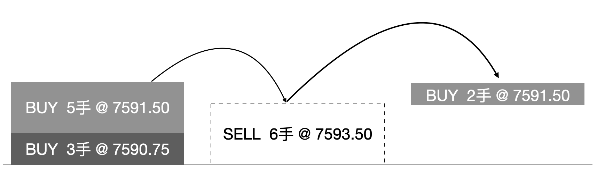
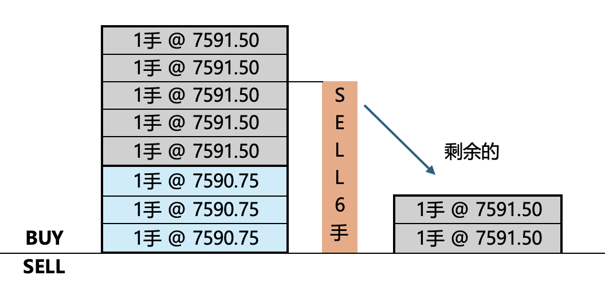
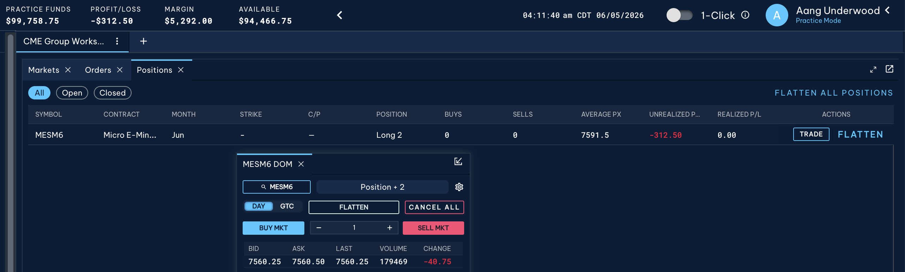
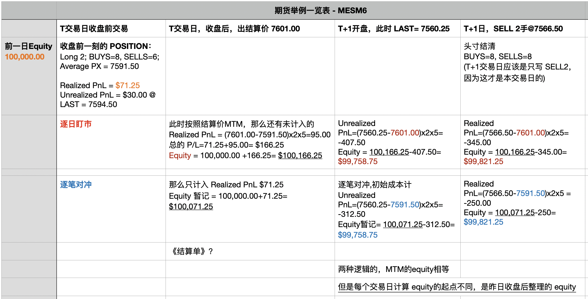

这些交易所，总是让人很意外。

## CME 模拟-1
- 初始时候：
**PRACTICE FUNDS**：100,000
**PROFIT/LOSS**：0.00
**MARGIN**：0.00
**AVAILABLE**：100,000.00

POSITION的情况也是什么都没有，尚且没有做任何BUYS和SELLS。

### <font color=blue>BUYS 3手成交</font>

操作：**Buy**, **QTY** = 3, **FILL PX** = 7590.75
操作完成之后，在**LAST** = 7592.00时：
**POSITION**: Long 3, BUYS 3 SELLS 0, **AVERAGE PX** = 7590.75, **Unrrealized P/L** = +18.75, **Realized P/L** = 0.00

**PRACTICE FUNDS**：100,018.75
**PROFIT/LOSS**：18.75
**MARGIN**：7,940.00
**AVAILABLE**：92,078.75

分析：
position尚未平掉，产生的盈亏都是因LAST成交价而变化的。
Long 3, Unrealized P/L = (Last 7592.00 - 7590.75)x3x5=18.75
Available = Practice Funds - Margin

### <font color=blue>BUYS 5手成交</font>

操作：**Buy**, **QTY** = 5, **FILL PX** = 7591.50
操作完成之后，在**LAST** = 7591.00时：
**POSITION**: Long 8, BUYS 8 SELLS 0, **AVERAGE PX** = 7590.22, **Unrrealized P/L** = -8.75, **Realized P/L** = 0.00

**PRACTICE FUNDS**：99,991.25
**PROFIT/LOSS**：-8.75
**MARGIN**：21,173.00
**AVAILABLE**：78,818.25

解析：
position没有平，产生的都是unrealized P/L，和LAST成交价挂钩。
细分来看，3手@7590.75 和 5手@7591.50，产生的加权均价应该是 8手@7591.218750，这里CME系统在POSITION表格中写的是 **AVERAGE PX** = 7591.22，这里不免让人疑惑，难道这么不严谨么？并不存在。这是因为：
- CME其实在POSTION TABLE中给出的AVERAGE PX是个加权值
- 但是反向操作（比如平仓）的时候，使用的原则是 **FIFO**
- **FIFO**: First In, First Out

这一点下面还会给你图示，一次给你讲明白!

### <font color=blue>SELL 6手成交</font>

操作：**Sell**, **QTY** = 6, **FILL PX** = 7593.50
操作完成之后，在**LAST** = 7594.50时：
**POSITION**: Long 2, BUYS 8 SELLS 2, **AVERAGE PX** = 7591.50, **Unrrealized P/L** = 30.00, **Realized P/L** = 71.25

**PRACTICE FUNDS**：100,101.25
**PROFIT/LOSS**：101.25
**MARGIN**：5294.00
**AVAILABLE**：94,807.25

这就是让人迷惑的地方了，SELL之前的 Long8，**AVERAGE PX** = 7590.22，怎么到了这一步骤完成后，POSITION Table中的**AVERAGE PX**，又等于 7591.50 了呢？还有就是这些
问题的核心就是：**FIFO**。你请仔细看下下图：



本例中，当你SELL 6手的时候，先平掉的是 `BUY 3手@7590.75`，然后是 `BUY 5手@7591.50`中的另外3个，剩余的 Long2，**average px依然还是 7591.50**！！

你看下图，是不是更好理解一些：


那么这样计算下来就有：
**REALIZED P/L** = 两部分 = (7593.50-7590.75)x3x5+(7593.50-7591.50)x3x5 = 41.25+30 = 71.25
**UNREALIZED P/L** = (7594.50-7591.5)x2x5=30
**PROFIT/LOSS** = **Unrealized P/L** + **Realized P/L** = 71.25+30=101.25
**MARGIN** = 5294.00
**AVAILABLE** = **PRACTICE FUNDS** - **MARGIN** = 100,101.25-5,294.00 = 94,807.25

---

### 本交易日settlement结算

so，折腾了一个交易日，现在本交易日出现了结算价：`7601.00$`。

如果你细想一下，是不是就是这样：交易日日中，每个瞬间，都有`LAST成交价`。LAST成交价变化，`Unrealized PnL`也在变化，从而导致 `Practice FUNDS`也在跳个不停？对不对？因为 `PRACTICE FUNDS`也就是`Equtiy`，是考虑了 `Unrealized PnL`。

**MTM**的真谛：其实这才是MTM的核心要义，不单单是咬准结算价的问题。本质上：每时每刻都在**Mark To Market**，都在向市场上的“公允价值”看齐，也就是 `LAST成交价` 看齐。为什么 `Practice Funds` / `Equity` 在不停的跳动？这种跳动就是因为它正在向 Market 进行 Mark。因为 Equity 是要考虑到现有头寸 marked to market的价格的，所以：**MTM 无时无刻不在**。

从这个角度理解，你就知道，在结算这个时候：所有的交易都要向结算价看齐了。在 settlement 这个阶段，要完成结算、划转保证金、出《结算单》等各个手续。在进行结算的时候，Equity 突然这一瞬间不再跳个不停了。

那么“结算”的含义是什么呢？结算的**本质**就是：**在特定准则下，以settlement price结算价为reference，把Realized P/L 结清**。Realized P/L从原来的账户（有点会计学概念的意思）结清，体现到Equity上。因为你一整天的操作之后，所有的 Realized P/L是都已经实现的，这个P/L的账户明天总不能再累计了吧，要算算张，结清一下。   

And now 是不是有两种思路？**逐日盯市** 和 **逐笔对冲** 呢？我来给你慢慢分析下哈。你不要潜意识认为“逐笔对冲”就不是坚持MTM准则了，其实还是坚持MTM的。只不过两种方式，对于**隔夜头寸**的处理，略有区别。

结算前，本交易日的情况可以概括为：

```text
Long 2; BUYS 8, SELLS 6; Average PX 7591.50; 
Unrealized P/L 30 @ LAST=7594.50; 
Realized PL 71.25
```

#### 逐日盯市

Settlement 7601.00 成交价，作为一个节点。明天开市的时候，头寸的成本重置成上一交易日的结算价。都MTM了，那岂不是隔夜头寸因MTM带来的损益也要计入到Realized PnL了。这样的话：

之前SELL 6手的 Realized PnL = 71.25
现在 LONG 2手的MTM带来的 PnL = (7601.00 - 7591.50)x2x5 = 95.00

那么今天的 Realized PnL = 71.25 + 90.00 = 166.25

所以这样的话，<font color=red>资金指标</font>：
**Equity / Practice Funds** = 100,000.00+166.25 = **100,166.25**
**P/L** = **166.25**
**Avaible** 还是 Equity - Margin 即可。

THUS：
- 最后，划转166.25到你的资金账户上。然后你的头寸还是你的。


#### 逐笔对冲

逐笔对冲的话，不基于MTM原则。那么每天的损益只包括：
1. 今天的操作带来的PnL
2. 不再向settlement price进行MTM的操作。隔夜头寸和结算价之间的损益，不计入当天的PnL，因为每个头寸都是按照成本价一直走。

所以这样的话，<font color=red>资金指标</font>：
**P/L** = **71.25** ?
**Equity / Practice Funds** = 100,000.00+166.25 = **100,071.25**
**Avaible** 还是 Equity - Margin 即可。

按照以往经验，无论是“逐日盯市”还是“逐笔对冲”，这个时候应该是有个《结算单》之类的东西给你看，显示多少钱是要冻结的就是margin，显示多少钱要划转走或者划转给你。这样的话，你也就有个可用余额类似 available balance之类的。

---

**sudden realization**：

其实，结算价，就相当是一个特殊的LAST成交价格对不对？只不过交易所给你留了一段时间结算。是不是可以理解结算价就是一段时间内“LAST成交价”维持不变？

整个交易就是一条河，连续不变；而结算价就是在这条河中的某个地方，拍一张照片snapshot而已。

你可以坚持MTM，逐日盯市，延迟到第二天的头寸都按照昨天结算价重新开始。那么每天结算的时候，PnL考虑的既有Realizeed PnL也有针对结算价MTM的Unrealized PnL。

也可以不坚持MTM，而是用逐笔对冲。每个头寸，停留在positin表格中都是紧跟成本价，平掉他的时候按照成本价计算realized PnL。那么这样的话，每天结算的时候，还是把结算价看成一个 LAST成交价的特例？

---

### <font color=blue>隔夜仓第二天</font>
上一交易日的结算价：`7601.00`元

#### 逐日盯市如下

那么还有一种算法：
昨天的 PnL 已经考虑了操作的损益还有MTM的损益，那么 PnL = 166.25
昨天结算后的 Equity = 100,166.25 ？？？？

今天的话，Long 2的成本就是 Long 2@7601.00
那么 **Unrealized PnL** = (`LAST`7560.25 - `昨Settlement`7601.00)x2x5 = -407.50

**Equity**/**Practice Funds** = 100,166.25 - 407.50 = 99,758.75

---

#### 逐笔对冲如下

一直没下单，但是potion是有隔夜仓的情况下，POSITION table：


之前结算完了的状态是：
- Equity = 100,071.25
- Long 2的成本还是 7591.50

这个时候出现的就是：LAST = 7560.25
**Realized P/L** = 0 （已经结清走人了）
**Unrealized P/L** = (`LAST`7560.25 - `AVEARGE PX`7591.50)x2x5 = -312.50
**PROFIT/LOSS** = **Realized P/L** + **Unrealized P/L** = -312.50
**Equity**/**Practice Funds** = 100,071.25 - 312.50 = 99,758.75


> **发现没，两个equity的结果是一样的！**

---

### SELL 2手成交

操作：**Sell**, **QTY** = 2, **FILL PX** = 7566.50

#### 逐日盯市 - 结算

**POSITION**: 空白, BUYS 0 SELLS 2
**Unrrealized P/L** = 0.00
**Realized P/L** = (7566.50-7601.00)x2x5 = -345.00
**P/L** = **Unrrealized P/L** + **Realized P/L** = -345.00
**Equity** = 昨天结算的equity + **P/L** = 100,166.25 - 345.00/ = **99,821.25**

---

#### 逐笔对冲 - 结算
**Realized P/L** = (7566.50-7591.50)x2x5 = -250.00
**P/L** = -250.00
**Equity** = 昨天结算的equity + **P/L** = 100,071.25 - 250.00 = **99,821.25**


---

## 总结“逐日盯市”和“逐笔对冲”

这两种东西，本质上就是：记账方式
不过，细致的你发现了，两种记账方式下，在我们上文的路径中：
- 交易日每时每刻，两种方式给出的 equity是相等的
- 对于交易日结束，给出结算价之后，略有不同？

Re-summarize 一下：

**T交易日**，买啊卖啊：

||BUYS|SELLS|AVERAGE PX|Unrealized P/L|Realized P/L|EQUITY|
|---|---|---|---|---|---|---|
|Long 2|8|6|7591.50|30 @ LAST 7594.50|71.25|100,101.25|

time ticking~，交易日结束，**结算价 7601.00**
这个时候《结算单>怎么写？后续T+1交易日怎么处理？


### 走逐日盯市路

#### T交易日当晚

以结算价 7601.00 为基准
Realized P/L = 71.25
Unrealized P/L realzied w.r.t settlement price = (7601.00-7591.50)x2x5 = 95.00
P/L = 71.25+95.00 = 166.25
Equity = 昨日equity + P/L = 100,000 + 166.25 = 100,166.25

#### T+1交易日当天MTM
**LAST** = 7560.25
Unrealized P/L = (7560.25 - 7601.00)x2x5 = -470.50
不存在Realized P/L
P/L=-470.25
Equity = 昨日Equity + P/L = 100,166.25-470.50 = **99,758.75**

#### T+1交易日SELL 2
**SELL 2 @ 7566.50**

Realized P/L = (7566.50-7601.00)x2x5 = -345.00
不存在 Unrealized P/L
P/L = Realized P/L + Unrealized P/L = -345.00
Equity = 昨日equity + P/L = 100,166.25 -345.00 = **99,821.25**

========

### 走逐笔对冲路

#### T交易日当晚
Realized P/L = 71.25
计算的equity = 100,000.00 + 71.25 = 100,071.25

少计入一笔损益?

#### T+1交易日当天MTM
**LAST** = 7560.25
Realized P/L = 71.25
Unrealized P/L = (7560.25-7591.50)x2x5= -312.50
equity = 100,071.25 - 312.50 = **99,758.75**


#### T+1交易日SELL 2
**SELL 2 @ 7566.50**
Realized P/L today = (7566.50 - 7591.50)x2x5= -250.00
equity = 昨天的equity + P/L = 100,071.25 -250.00 = **99,821.25**


### 给你个表格，一把看明白


---


# CME中的核心原则

我暂时还分不清是，交易所对会员结算，还是broker对客户结算。我记得国内的期货书上是有两种说法的：
- 什么逐日盯市：是不是就是MTM，每天的未了结合约要MTM to market settlement
- 什么逐笔对冲，是不是，依然MTM，就只是不考虑每天交易结束之后，对着settlement price 每天搞一下了？
TOC ~~~

