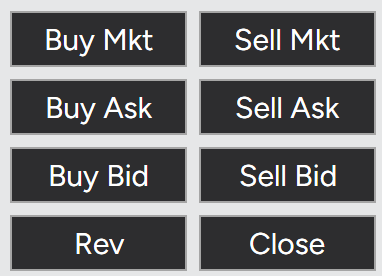

如果你使用 NT，Ninja忍者的交易软件，一般叫做NT，那么你会在操作界面看到这样的buttons。



前面是6个，后面是两个。我们分开介绍，你也多多操作实践，模拟账户又不要钱。

这几个按钮，介绍的是：
- **Market Order**（市价单）
- **Limit Order**（限价单）
- **Bid / Ask** 概念
- **Trader / Maker** 概念

假定 Order Book 是这样：
```text
        Ask
18.50  @ 20手
18.25  @ 10手
-------------
18.00  @ 10手
17.75  @ 15手
17.50  @ 10手
17.25  @ 20手
Bid
```

那么我们现在就有：
- **Best Ask** = $ 18.25
- **Best Bid** = $ 18.00
- **Spread** = $ 0.25

--

### **BUY Mkt**
发送`BUY Mkt`，成交价 $ 18.25
吃掉 Ask的18.25挂单，如果挂单1张，成交后：
```text
18.50 @ 20手
18.25 @ 9手
```
--

### **SELL Mkt**
发送`SELL Mkt`，成交价 $ 18.00
吃掉 Bid 的18.00的挂单，如果挂单1张，成交后：
```text
18.00 @ 9手
17.75 @ 15手
```

--

### **BUY Ask** - 防止BUY Mkt滑单

限价单，生成BUY的单子，限制是 Best Ask？
BUY LIMIT 18.25
因为有人挂着18.25的Ask，立刻会成交

但是不是 BUY Mkt，而是 BUY LIMIT （当前ASK价格）

如果你按下按钮瞬间盘口变化，Ask的最低从18.25变成18.50了，那么 `BUY Mkt`就会追着用18.50成交了。而`BUY Ask`会变成 `BUY LIMIT 18.25`挂在那里，等待成交。

因为`BUY Mkt`可能被滑点，而`BUY Ask`相当于：
- 我要立即成交，但绝不接受高于当前 Ask 的价格。


### **SELL Bid** - 防止SELL Mkt滑单
限价单，生成SELL的单子，限制是Best Bid？
SELL LIMIT 18.00

不是SELL Mkt，而是SELL LIMIT （当前Bid价格）


---

### **BUY Bid**
Bid本来就是BUY这一边的，怎么还用 BUY Bid做限制呢？
限价单，生成BUY的单子，限制是 Best Bid
BUY LIMIT 18.00
挂单等待
你BUY还要用Bid做限制~

### **SELL Ask**
Ask本来就是SELL这一边的，怎么还用 SELL Ask做限制呢？
限价单，生成SELL的单子，限制是 Best Ask
SELL LIMIT 18.25
挂单等待
你SELL还要用Ask做限制

我们把NT的6个按钮归纳：
|按钮|实际发出的订单|
|---|---|
|**Buy Mkt**|Buy Market|
|**Sell Mkt**|Sell Market|
|**Buy Ask**|Buy Limit @ Best Ask|
|**Sell Bid**|Sell Limit @ Best Bid|
|**Buy Bid**|Buy Limit @ Best Bid|
|**Sell Ask**|Sell Limit @ Best Ask|

这样以整理是不是就清楚多了呢？

---
