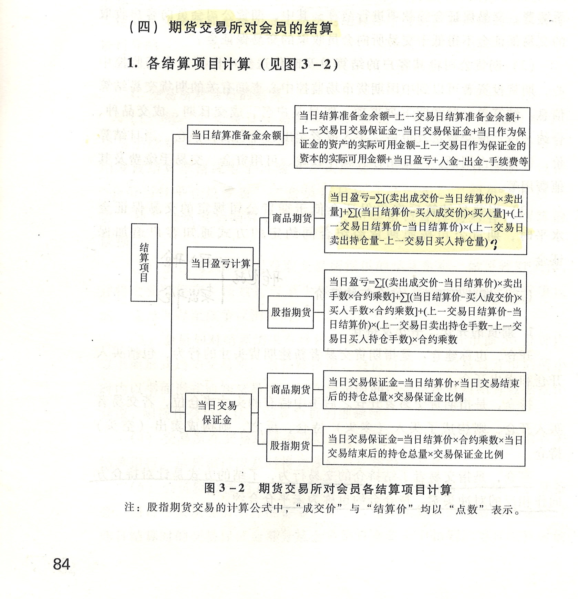
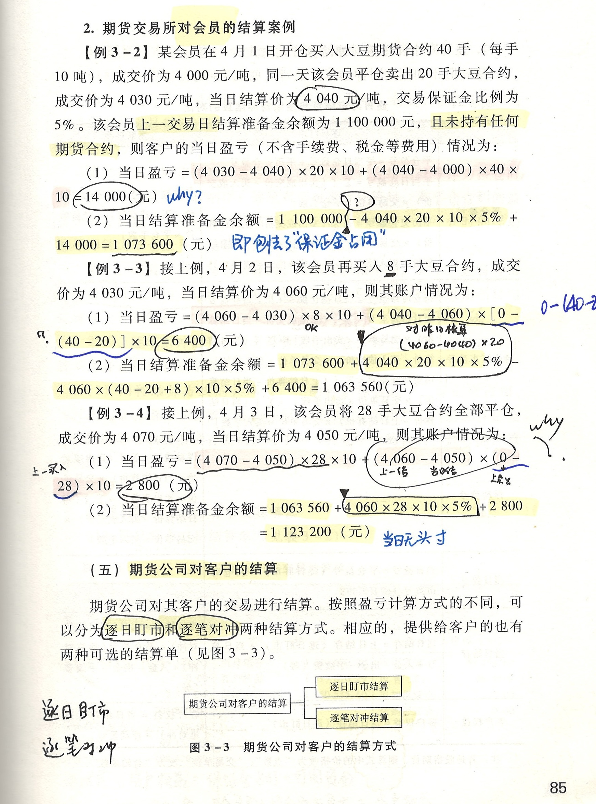
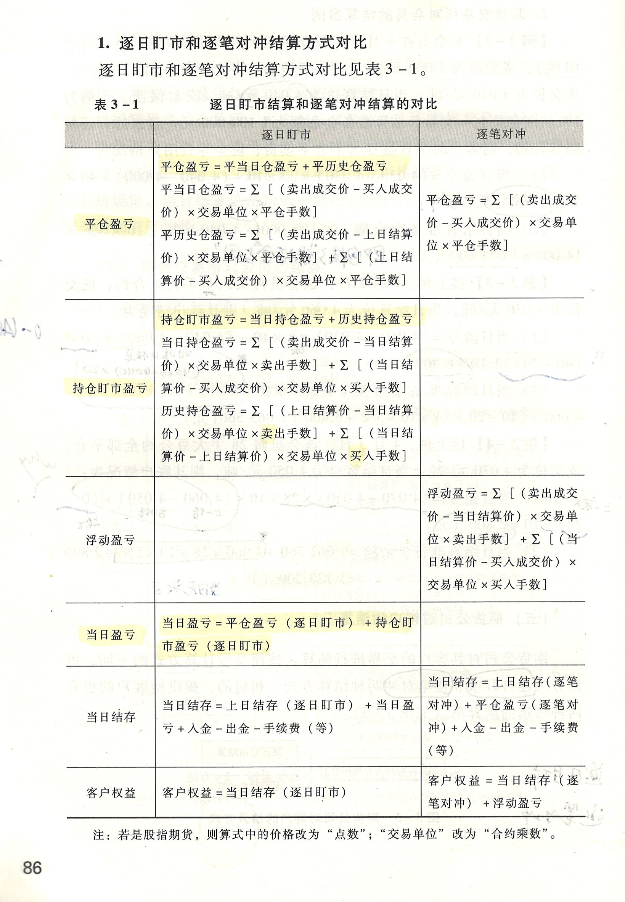
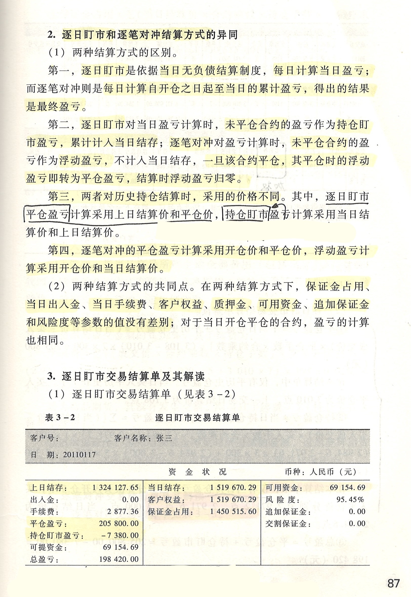
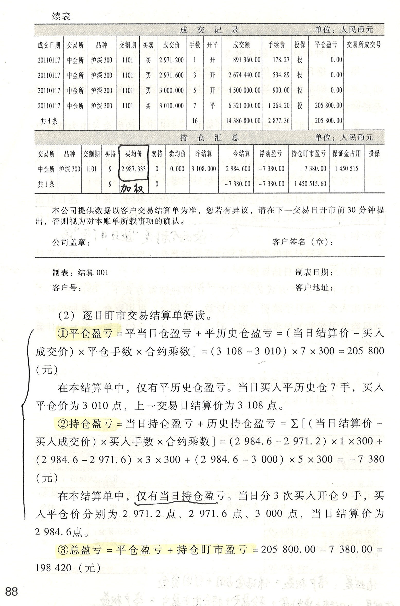
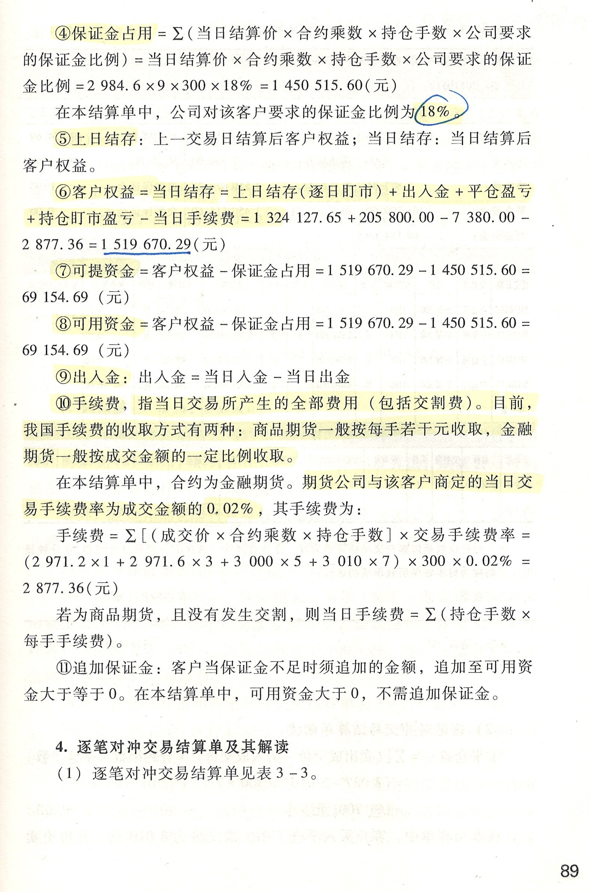
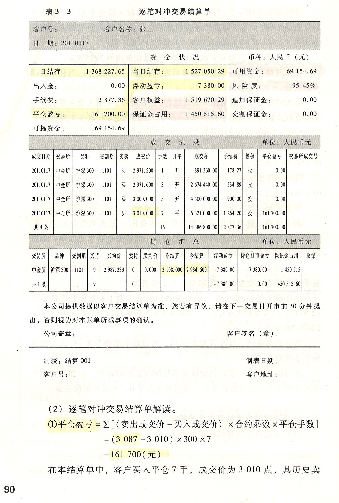
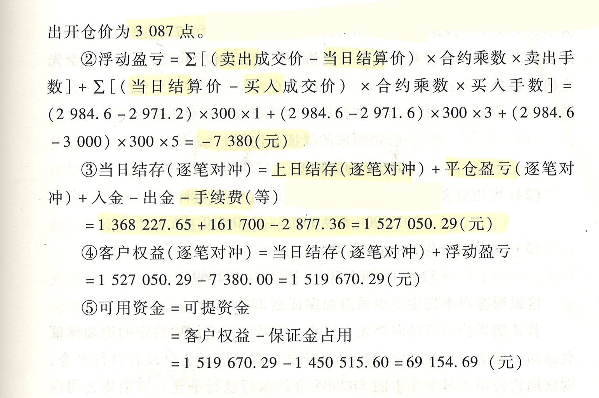

我们来解决一直以来的拦路虎，这玩意。

# 期货交易所对会员的结算
交易所对会员，和会员对客户，是完全不同的。

- 结算准备金
    - 某个交易日的
    - 余额
    - 是用于结算的
是用来应对盈亏的。

- 交易保证金
    - 某个交易日的
    - 出金、入金
    - 保证金是 f(隔夜仓情况)的，focusing on 当日交易结束后的持仓总量。
    - 如果你没有隔夜持仓，那么你就不需要准备交易保证金
但是持仓的时候，你也要有交易保证金的占用，否则你就可以无限持仓了
交易保证金的本质是：持仓保证金（Position Margin / Initial Margin），是为了仍然存在的未平仓合约，而缴纳的保证金。

---

**Initial Margin**（初始/持仓保证金）,对应：为未来潜在风险准备。
即：“你可能明天亏钱。”

所以：只要持仓还在，就必须占用。
initial marigin的initial不是第一次交易，而是建立头寸时，就必须先缴纳的保证金。
initial margin和总头寸有关系，和净头寸关系怎么说呢，是个risk scenario的问题。否则我1亿long1亿short岂不是扯淡了。

**Variation Margin**（逐日盯市盈亏）

对应：已经发生的盈亏，就是每天真实划转。

- 当日盈亏
    - 成交价
        - 卖出
        - 买入
    - 当日结算价
    - 买入量、卖出量

---

**当日盈亏=**
Σ`[(卖出成交价－当日结算价)×当日卖出量]`
+
Σ`[(当日结算价－买入成交价)×当日买入量]`
+
`(上一交易日结算价－当日结算价)`×`(上一交易日卖出持仓量－上一交易日买入持仓量)`
这里：
- 上一交易日**卖出持仓量** = **空头持仓量** (和T-1交易日的买卖簿没关系，就看剩的position)
- 上一交易日**买入持仓量** = **多头持仓量** (和T-1交易日的买卖簿没关系，就看剩的position)
这里就是非常绕，这里的实际上它说的是：**持仓方向**，而不是**交易动作**。

> 这就是非常扯淡的一点。在中文的语境中，总是纠结“买和卖”的问题。但是在英文的资料中，并不去使用buy & sell这样的语言。
> 基本上就是：long / short position的语言体系
- 中文的“多开、空平”：其实是“方向”+“动作”

|中文|英文表达|含义|
|---|---|---|
|多开|Buy to Open|买入建立多头-买入的方式建立仓位，long|
|空开|Sell to Open|卖出建立空头-卖出的方式建立仓位，short|
|多平|Sell to Close|卖出平掉多头-卖出的方式平掉仓位，平掉long position|
|空平|Buy to Close|买入平掉空头-买入的方式平掉仓位，平掉short position|

这种描述在Futures、Options、Margin Trading、CFD、IBKR/TWS、Thinkorswim中是很常见的。
然后在交易软件中经常能看到：

|**Button**|meanings|notes|
|---|---|---|
|**BTO**|Buy to Open|open long position，开多头|
|**STO**|Sell to Open|open short position，开空头|
|**BTC**|Buy to Close|close short position，平空头|
|**STC**|Sell to Close|close long position，平多头|

这经常在trading software中见到。

而对于前面的，上一交易日买入持仓、上一交易日卖出持仓，英文的表达更多是：
- **Previous day's long position**
- **Previous day's short position**
或者更专业一点
- **Prior day long open interest**
- **Prior day short open interest**

究其原因，是中国金融教材比较会计化，强调：仓位是如何建立的。多头持仓是原来的买入开仓建立的，所以就叫做“买入持仓量”；空头持仓是卖出开仓建立的，所以就叫做“卖出持仓量”。但是英文世界更强调**当前的风险方向（exposure）**，所以更喜欢使用：
- **long exposure** v.s. **short exposure**
- **net long** v.s. **net short**

英文描述中还有个非常重要的概念
**Open Interest**：未平仓合约量（整个市场的根本原则是：**总多头=总空头**）
中文教材习惯从“动作”命名：买入持仓、卖出持仓
英文交易里，更喜欢“**从风险方向**”命名，使用long或者short这样的方式来标识风险敞口。

我们具体来看下面的示例。

当仓位非常多的时候，你不可能跟踪每一个头寸。你能够进行的操作无非就是：
自己有个交易簿，trade book。trader我们每天交易开始前，就会看到这样一个book，你也只能是这样一个book。

然后就是每天的操作了，操作可以分成4种
- 开仓买入 - 多开
- 开仓卖出 - 空开
- 平仓买入 - 空平
- 平仓卖出 - 多平

|操作|大名|开平|多空|小名|解释|实际操作|
|---|---|---|---|---|---|---|
|多头头寸-建立|开仓买入|开|多|多开||买|
|空头头寸-建立|开仓卖出|开|空|空开||卖|
|空头头寸-平掉|平仓买入|平|空|空平|呼应“开仓卖出”(空开)|买|
|多头头寸-平掉|平仓卖出|平|多|多平|呼应“开仓买入”(多开)|卖|

- 买入什么方向的仓位，将来平掉的时候，就叫“对应方向”的“平”
- 空开->空平；多开->多平

那么回来，我们再说今天T交易日发生的事情：
大豆合约：每手10吨
隔夜仓ZERO：
- T-1交易日结束后，未能平仓的 long position：ZERO
- T-1交易日结束后，未能平仓的 short position：ZERO

## T交易日
`T交易日`当天的操作：
||数量|价格|开平|多空|买卖|
|---|---|---|---|---|---|
|开仓买入 |40手 |4000元/吨|开|多|买|
|平仓卖出|20手|4030元/吨|平|多|卖|

当日结算价：4040元/吨
隔夜持仓统计：
- 买入持仓 @ 20手 @ long positoin
- 卖出持仓 @ 0 手 @ short position

根据前面的公式，当日盈亏的计算：
**当日盈亏=**

||计算|
|---|---|
|Σ`[(卖出成交价－当日结算价)×当日卖出量]`|(4030 - 4040)x**20**x10= -10x20x10= -2000|
|Σ`[(当日结算价－买入成交价)×当日买入量]`|(4040-4000)x**40**x10=16000|
|`(上一交易日结算价－当日结算价)`×`(上一交易日卖出持仓量－上一交易日买入持仓量)`|(?-4040)x(0-0)|

这里的核心就是，为啥`segment 3`就一定是0呢？第三段算的是“隔夜仓今天的盯市盈亏”。没有隔夜仓，第三段就是 0。还不是因为“上一交易日卖出持仓量”就是隔夜**空头持仓量**，“上一交易日买入持仓量”就是隔夜**多头持仓量**，因为都没有，可不就是ZERO。

## T+1交易日
1- 
初始持仓 @ **long** position / **买入持仓**：20手
上一交易日结算价/settlement price：4040元/吨
2- 
当日：
**买入**开仓 @ 多开 @ **BTO** / But to Open：8手 @ 4030元/吨
3- 
当日结算价：4060元/吨
隔夜仓位：多头/long position @ 28手

**当日盈亏=**

||计算|
|---|---|
|Σ`[(卖出成交价－当日结算价)×当日卖出量]`|0 没有卖出|
|Σ`[(当日结算价－买入成交价)×当日买入量]`|(4060-4030)x**8**x10=2400|
|`(上一交易日结算价－当日结算价)`×`(上一交易日卖出持仓量－上一交易日买入持仓量)`|(4040-4060)x(0-20)x10=4000|

总计就是：2400+4000=6400

## T+2 交易日
1- 
初始持仓 @ long position / 买入持仓：28手
上一交易日结算价/settlement price：4060元/吨
2- 
当日：
**卖出**平仓 @ 多平 @ **STC**/Sell to Close：28手 @ 4070元/吨
3- 
当日结算价：4050元/吨
隔夜仓位：ZERO

**当日盈亏=**

||计算|
|---|---|
|Σ`[(卖出成交价－当日结算价)×当日卖出量]`|(4070-4050)x28x10=5600|
|Σ`[(当日结算价－买入成交价)×当日买入量]`|0 没有买入|
|`(上一交易日结算价－当日结算价)`×`(上一交易日卖出持仓量－上一交易日买入持仓量)`|(4060-4050)x(0-28)x10=-2800|

总计就是：5600-2800=2800

---

## 还可以换一种美式思路

# 期货公司对客户的结算

---

行情软件上的显示：
在某个时刻，同时存在：
- A 多开买入
- B 空开卖出
那么行情软件挂单就是：买入@A的买入价 vs 卖出@B的卖出价
成交后：
* A 得到多头
* B 得到空头

但行情软件上可能只显示：**一笔 Buy 成交**因为是买方主动吃单。
但是这样的成交历史决定了：**头寸的总数，amount 增加了**。

原则：
**任何时候，多头头寸总数 = 空头头寸总数**

---

中文教材

英文常见表达

当日盈亏

daily P&L / daily mark-to-market P&L

逐日盯市

mark-to-market / daily settlement

变动保证金

variation margin

上日结算价

previous settlement price / prior settlement price

当日结算价

current settlement price / today’s settlement price

多头持仓

long position

空头持仓

short position

净持仓

net position

未平仓盈亏

open trade equity, OTE

期权净值

net option value, NOV

清算所收付

payment to/from the clearinghouse